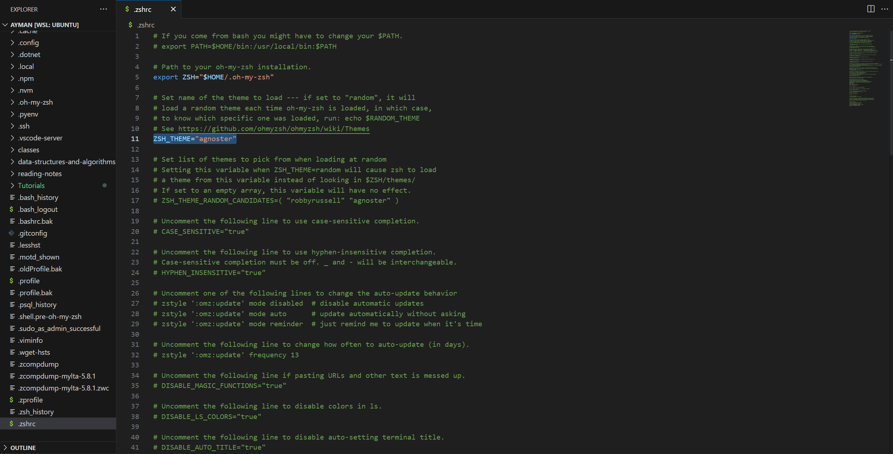
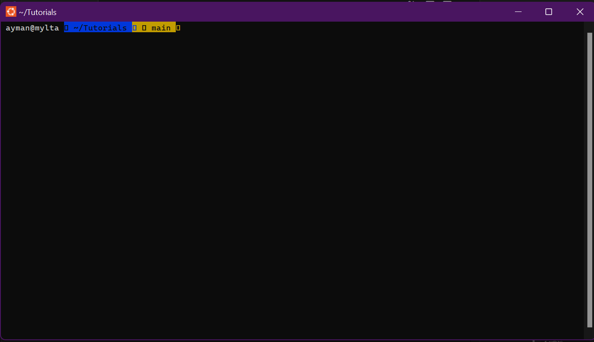
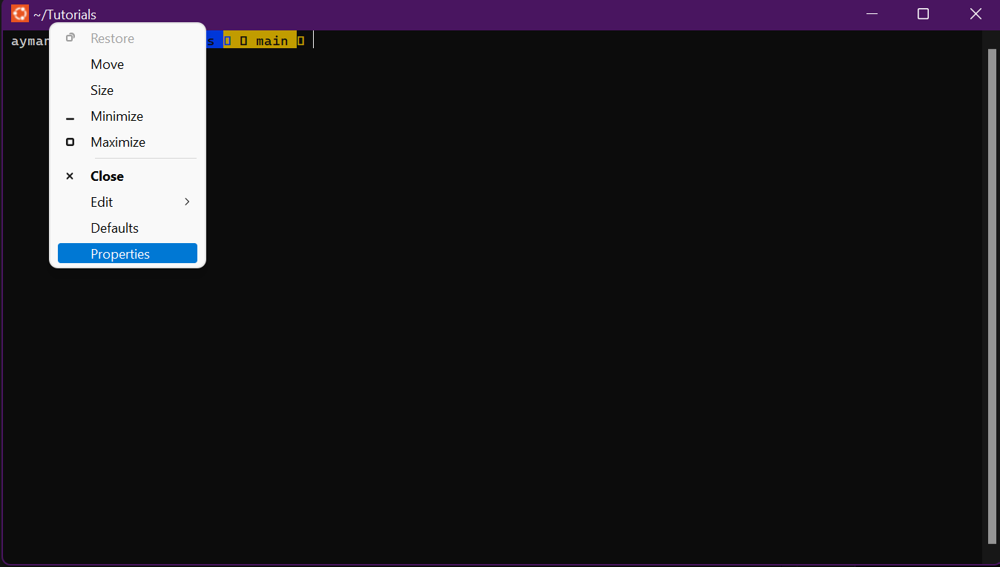
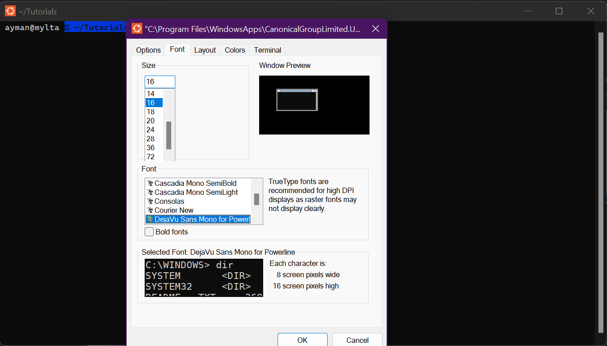
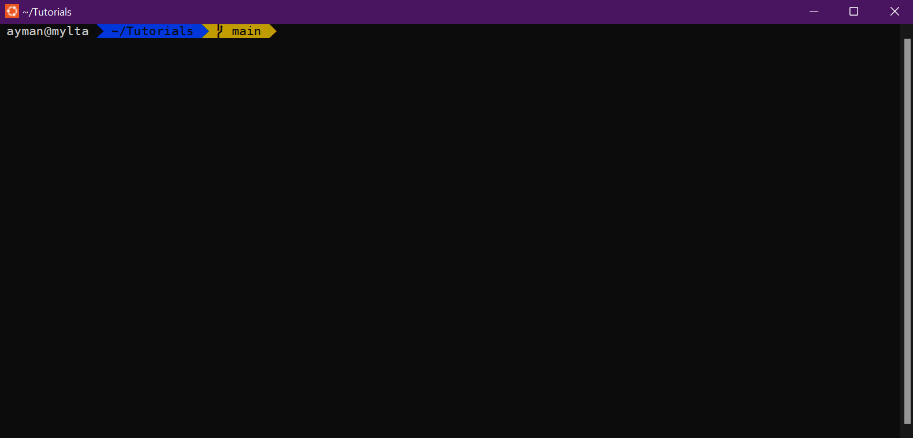

# How to add Themes to Z shell

## **Warning:** Please backup any file we will attempt to modify in case anything goes wrong

## **Step 1:** Edit Defult Theme

* go to the directory where your .zshrc is located, usually, it is in your home directory.

1. In your bash terminal type ```code ~/.zshrc``` or ```vim ~/.zshrc```
2. Chose a theme you like from this [List](https://github.com/ohmyzsh/ohmyzsh/wiki/Themes)

3. Replace your theme with the default theme


Now if your terminal looks like this you must install Powerline fonts 


## **Step 2:** Installing Powerline fonts

## **Linux**
* Run the following command in your terminal 

```sudo apt-get install fonts-powerline```
* Close then reopen your terminal
* You are good to go


## **Windows**
Follow this step-by-step tutorial to add Powerline fonts to your Windows OS.

* ### [Link](https://gist.github.com/stramel/658d702f3af8a86a6fe8b588720e0e23)

* ### Changing the terminal font

1. Open your terminal and right-click on the taskbar
2. Chose properties option 
3. Chose DejaVu Sans Mono or any compatible font 

## **Step 3:** Enjoy :)


